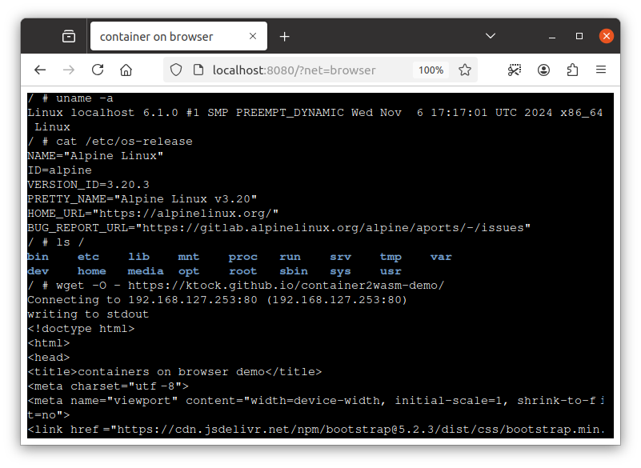

# Running containers on browser with QEMU with networking enabled

c2w's `--to-js` flag enables to run containers on QEMU ported to browser with emscripten ([QEMU Wasm](https://github.com/ktock/qemu-wasm)).
Multicore CPUs can also be enabled leveraging MTTCG(Multi-Threded TCG).

[Networking](../networking) is also enabled.

> For differences between this approach and WASI-on-browser approach, refer to [`../../examples/wasi-browser/`](../../examples/wasi-browser/).

## Step 1: Converting an image to Wasm

x86_64, AArch64 and RISCV64 containers are supported as of now.

### Converting x86_64 container to Wasm

```
$ mkdir -p /tmp/out-js4/htdocs
$ c2w --to-js alpine:3.20 /tmp/out-js4/htdocs/
```

### Converting AArch64 container to Wasm

```
$ mkdir -p /tmp/out-js4/htdocs
$ c2w --to-js --target-arch=aarch64 arm64v8/alpine:3.20 /tmp/out-js4/htdocs/
```

### Converting RISC-V container to Wasm

```
$ mkdir -p /tmp/out-js4/htdocs
$ c2w --to-js --target-arch=riscv64 riscv64/alpine:3.20 /tmp/out-js4/htdocs/
```

### Increasing number of emulated CPU cores

QEMU Wasm enables MTTCG(Multi-Threaded TCG) of QEMU for utilizing host's multiple cores for emulating guest CPUs.
You can emulate multiple guest CPUs using a build arg `VM_CORE_NUMS=<number of CPUs>`.
For example, the following emulates 4 CPUs with MTTCG enabled.

```
$ c2w --to-js --build-arg VM_CORE_NUMS=4 alpine:3.20 /tmp/out-js4/htdocs/
```

## Step 2: Start a server

Serve the image as the following (run them at the repository root dir):

```
$ ( cd ./examples/emscripten/htdocs/ && npx webpack && cp -R index.html dist vendor/xterm.css /tmp/out-js4/htdocs/ )
$ wget -O /tmp/c2w-net-proxy.wasm https://github.com/ktock/container2wasm/releases/download/v0.5.0/c2w-net-proxy.wasm
$ cat /tmp/c2w-net-proxy.wasm | gzip > /tmp/out-js4/htdocs/c2w-net-proxy.wasm.gzip
$ cp ./examples/emscripten/xterm-pty.conf /tmp/out-js4/
$ docker run --rm -p 8080:80 \
         -v "/tmp/out-js4/htdocs:/usr/local/apache2/htdocs/:ro" \
         -v "/tmp/out-js4/xterm-pty.conf:/usr/local/apache2/conf/extra/xterm-pty.conf:ro" \
         --entrypoint=/bin/sh httpd -c 'echo "Include conf/extra/xterm-pty.conf" >> /usr/local/apache2/conf/httpd.conf && httpd-foreground'
```

> Alternatively, you can also build c2w-net-proxy.wasm as the following:
>
> NOTE: Run this at the project repo root directory. Go >= 1.21 is needed on your machine.
> 
> ```
> $ make c2w-net-proxy.wasm
> ```

## Step 3: Accessing to the pages

The server started by the above steps provides the following pages.



### `localhost:8080?net=browser` 

This URL serves the image with enabling [networking leveraging Fetch API](../networking/fetch/).
For example, you can accesses to a site using wget (`wget -O - https://ktock.github.io/container2wasm-demo/`).

This is implemented by running a networking stack ([`c2w-net-proxy`](../../../extras/c2w-net-proxy)) inside browser and connecting it to emscripten levaraging [Mock service Worker's WebSocket interception](https://mswjs.io/docs/basics/handling-websocket-events/)

Please refer to [`../networking/fetch/`](../networking/fetch/) for more details about Fetch-API-based networking.

### `localhost:8080?net=delegate=ws://localhost:8888`

This serves the image with enabling [networking leveraging WebSocket API](../networking/websocket/).
On the host, you need to start the network stack listening on the WebSocket (e.g. `localhost:8888`) in advance.

```
$ c2w-net --listen-ws localhost:8888
```

> NOTE1: `localhost:8888` can be changed to another address.
> NOTE2: `c2w-net` is available on the [release page](https://github.com/ktock/container2wasm/releases).

Please refer to [`../networking/websocket/`](../networking/websocket/) for more details about WebSocket-based networking.

### `localhost:8080`

This starts a container without NW.
